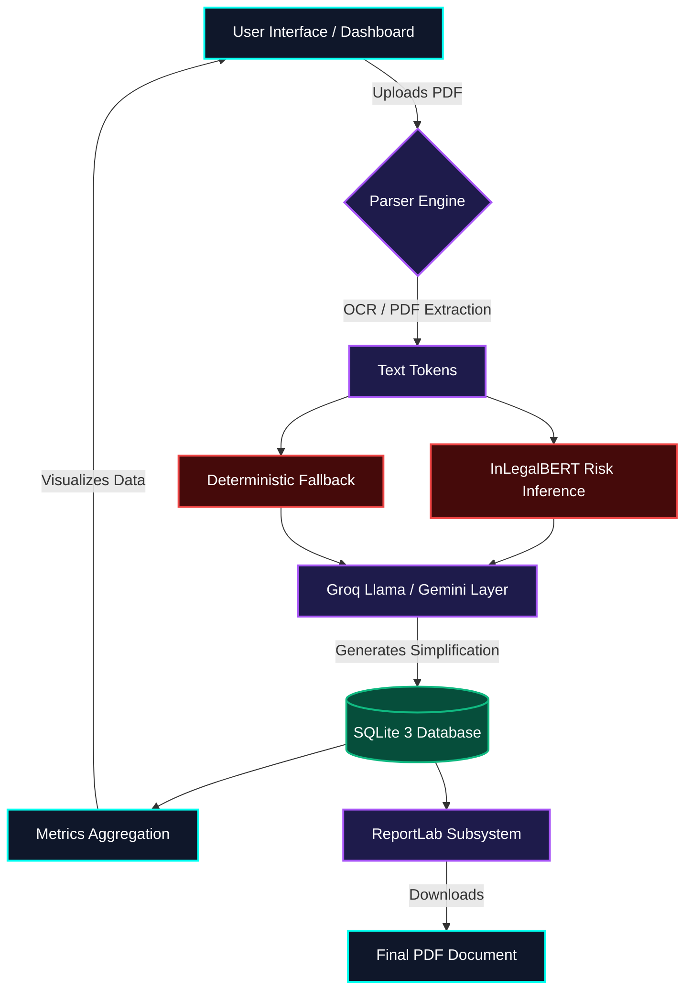

<!-- 
=======================================================================
                            LEXGUARD AI
                    FUTURISTIC README TEMPLATE
=======================================================================
-->

<div align="center">

<!-- Animated Header -->


<!-- Typing Animation for Features -->
<a href="https://github.com/eswardasknair/lexguard">
  
</a>

<br/>

<!-- Interactive Badges -->
<a href="#machine-learning-engine"></a>
<a href="#backend-architecture"></a>
<a href="#data-processing"></a>
<a href="#license"></a>

---

<table align="center" style="border: none;">
  <tr>
    <td align="center" width="25%"><a href="#-core-philosophy"><b>Philosophy</b></a></td>
    <td align="center" width="25%"><a href="#-interactive-architecture"><b>Architecture</b></a></td>
    <td align="center" width="25%"><a href="#-deep-dive-features"><b>Features</b></a></td>
    <td align="center" width="25%"><a href="#-quick-start"><b>Quick Start</b></a></td>
  </tr>
</table>

</div>

---

<br>

<div align="center">
  
</div>

## 🌌 Core Philosophy: Law Meets Cybernetics

**LexGuard AI** completely dismantles the barrier between complex legal jargon and human understanding. Focused relentlessly on **Indian Law**, this platform fuses state-of-the-art NLP (Natural Language Processing) with high-speed LLM inference to act as an autonomous, hyper-intelligent paralegal. It doesn't just read documents; it calculates liability out of raw text.

<table>
<tr>
<td width="50%">
<h3 align="center">The Problem 🧱</h3>
Legal contracts are intentionally dense, trapping individuals and corporations in ambiguous liabilities. Traditional review processes are slow, expensive, and subject to human fatigue, particularly when referencing sprawling Indian Legal Acts.
</td>
<td width="50%">
<h3 align="center">The LexGuard Solution 🚀</h3>
Contracts are digested through a massive AI pipeline. Clauses are classified, mapped against a localized neural-net (InLegalBERT), assigned quantified risk scores interactively, and translated into plain English instantaneously by Groq's Llama models.
</td>
</tr>
</table>

<br>

<div align="center">
  
</div>

## 🧬 Interactive Architecture

The LexGuard application operates on a highly decentralized internal pipeline. Click the dropdowns to explore exactly how data flows through the system.

<details>
<summary><kbd>► PHASE 1: Document Upload & OCR Layer</kbd></summary>
<br>

When a user uploads a file, it passes through the `extract_text_from_file` pipeline:
1. **PyMuPDF (`fitz`)**: Attempts a clean digital text extraction from PDFs.
2. **PyPDF2**: Fallback if digital extraction fails on specific encodings.
3. **`python-docx`**: Parses raw Microsoft Word XML structures seamlessly.
4. **Tesseract OCR Pipeline**: If the file is a scanned PNG/JPG/TIFF, image processing agents deploy OCR to read pixels, converting them back into structured text arrays.

</details>

<details>
<summary><kbd>► PHASE 2: Transformers & Machine Learning</kbd></summary>
<br>

The extracted raw text enters `LexGuardInference`:
1. **Sentence Tokenization**: The document is split into individual legal clauses.
2. **InLegalBERT Processing**: Each sentence is fed into Hugging Face’s `InLegalBERT`, outputting an embedding layer.
3. **Risk Classification**: The embedding map identifies `Critical`, `High`, `Medium`, or `Low` risk factors based on historic legal datasets.
4. **Rule-Based Fallback**: An ultra-fast regex deterministic layer ensures robust execution even if the GPU/CPU inference throttles.
</details>

<details>
<summary><kbd>► PHASE 3: Generative AI Enrichment Layer</kbd></summary>
<br>

All identified clauses are pushed to the Cloud orchestration layer (`ai_explainer.py`):
1. **Groq Llama-3.1-70B Engine**: Processes queries at over 800 tokens per second context-mapping the clause to Indian Law.
2. **Gemini / Pollinations Failover**: If primary API limits are hit, a fallback orchestrator ensures 100% uptime for generating Plain English translations and rewrite suggestions.
</details>

<details>
<summary><kbd>► PHASE 4: Rendering & Analytics</kbd></summary>
<br>

1. **Django ORM**: Clauses are asynchronously saved to `AnalyzedClause` models.
2. **Dashboard UI**: HTML5 interfaces read metrics (`Avg`, `Count`) generating dynamic Chart.js risk distributions.
3. **PDF Generator**: `ReportLab` parses the database object and mathematically draws a native, colored PDF executive report for download.
</details>

<br>

### 🖥️ End-to-End System Diagram



<div align="center">
  
</div>

## 🤖 Deep Dive: Features & Capabilities

<table>
  <tr>
    <td align="center">
      
      <h3>Advanced Dashboard Analytics</h3>
    </td>
    <td>
      LexGuard’s dashboard calculates <strong>Overall Risk Scores</strong> instantaneously. Interactive Chart.js elements visualize the concentration of Critical and High-Risk clauses. Real-time data aggregation directly queries the SQLite interface to identify bottlenecks in your legal review process.
    </td>
  </tr>
  <tr>
    <td align="center">
      
      <h3>Autonomous Clause Rewriting</h3>
    </td>
    <td>
      Not only does LexGuard spot the danger, but it also <strong>fixes it</strong>. Using a custom AJAX backend endpoint mapped to a 70 Billion parameter Groq Llama model, the <code>rewrite_clause_view</code> modifies heavily biased corporate clauses into mutually fair, legally sound alternatives.
    </td>
  </tr>
  <tr>
    <td align="center">
      
      <h3>The "Indian Law Book" AI Agent</h3>
    </td>
    <td>
      Built strictly for the Indian Judicial framework. An embedded search agent (<code>law_book_list</code>) takes vague user queries, maps them to JSON objects, and searches its synthesized memory to directly quote <strong>Sections and Acts</strong> of the Indian Constitution, Companies Act, and Information Technology Act.
    </td>
  </tr>
  <tr>
    <td align="center">
      
      <h3>Automated Report Generation</h3>
    </td>
    <td>
      A proprietary <code>download_report</code> logic built on ReportLab. LexGuard programmatically draws color-coded borders (Red for Critical, Green for Low), dynamic pie charts inside the PDF itself, and calculates Executive Summaries.
    </td>
  </tr>
</table>

<div align="center">
  
</div>

## 🎬 Interactive Demonstration (System Before/After)

Curious how LexGuard transforms data? Here’s a conceptual comparison of the Engine.

<table align="center" width="100%">
<tr>
<th align="center" width="50%">❌ RAW UNPROCESSED UPLOAD</th>
<th align="center" width="50%">✅ LEXGUARD AI PARSED OUTPUT</th>
</tr>
<tr>
<td>
<pre><code>"The user agrees to indemnify and hold
harmless the corporate entity from any 
and all indirect, consequential, and 
foreseeable claims including loss of 
revenue, regardless of negligence."</code></pre>
</td>
<td>
<pre><code class="language-json">{
  "clause_type": "Indemnification",
  "risk_level": "CRITICAL",
  "risk_score": 95,
  "simplified_english": "You are taking 100% of the fault, even if the company messes up.",
  "rewrite_suggestion": "Both parties agree to mutually indemnify against gross negligence."
}</code></pre>
</td>
</tr>
</table>

<div align="center">
  
</div>

## 🛠️ Tech Stack & Ecosystem

<p align="center">
  <a href="https://skillicons.dev">
    
  </a>
</p>

- **Core Backend**: `Python 3.10+`, `Django 5.x`
- **Frontend Assets**: Responsive `HTML5`, `CSS3`, `Vanilla JS`, `Chart.js`
- **Machine Learning**: `PyTorch`, `Transformers`
- **Generative Models**: `Groq API`, `Gemini API`, `Pollinations AI`, `Llama-3.1-70B`
- **Document Extractors**: `PyMuPDF`, `pytesseract`, `python-docx`
- **Document Creators**: `ReportLab`


<div align="center">
  
</div>


## ⚡ Quick Start & Deployment Guide

Ready to initialize the AI engine locally? Follow these precise terminal commands. 

<details open>
<summary><kbd>STEP 1: Clone & Isolate Environment</kbd></summary>

```bash
# Pull the latest main branch
git clone https://github.com/eswardasknair/lexguard.git
cd lexguard

# Initialize a Virtual Environment (Mandatory for dependency isolation)
python -m venv venv

# Activate Environment (Windows)
venv\Scripts\activate
```
</details>

<details open>
<summary><kbd>STEP 2: Provision Dependencies</kbd></summary>

*(Ensure you have Microsoft C++ Build Tools if you encounter PyMuPDF or Tesseract compilation errors on Windows)*

```bash
# Upgrade pip and install core requirements
python -m pip install --upgrade pip
pip install -r requirements.txt
```
</details>

<details open>
<summary><kbd>STEP 3: Configure Environment Variables</kbd></summary>

Create a strictly formatted `.env` file at the root. **Never commit this file.**

```env
# ⚙️ SYSTEM SETTINGS
DEBUG=True
SECRET_KEY=generate_a_secure_dj_secret_key

# 🧠 API KEYS (Critical for Inference)
# Provide your keys; the system handles rate-limiting and failovers
GEMINI_API_KEY=your_gemini_key_here
GROQ_API_KEY=your_groq_key_here
```
</details>

<details open>
<summary><kbd>STEP 4: Ignite the Protocol</kbd></summary>

```bash
# Synchronize internal data models
python manage.py makemigrations
python manage.py migrate

# Engage server daemon
python manage.py runserver
```

> 🟢 System Online: Point your browser to `http://localhost:8000`
</details>

---

<br>

<div align="center">
  
###  The Roadmap

[](#)
[](#)
[](#)
[](#)

<br/>

Designed and engineered globally by **[LexGuard Team]**. <br>
Pushing the boundaries of Algorithmic Justice.

<a href="https://github.com/eswardasknair/lexguard/stargazers">
  
</a>


</div>
